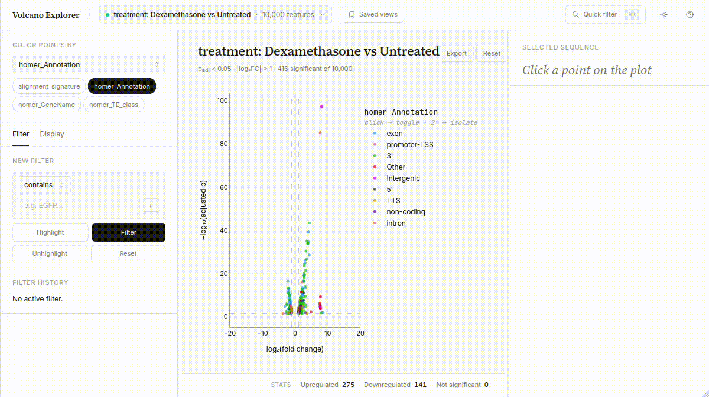

# ReadDiff

A command-line tool for discovering differentially expressed reads. It builds on the Needle algorithm for alignment-free, minimizer-based sequence quantification ([Darvish et al., 2022](https://doi.org/10.1093/bioinformatics/btac492)). Rather than measuring expression over predefined annotations such as genes or transcripts, `readdiff` performs differential testing directly on sequencing reads, enabling unsupervised and annotation-independent discovery of expression changes.



## Installation

**With conda:**

This will work after adding to bioconda:
```bash
conda create -n readdiff -c conda-forge -c bioconda readdiff
```
Until then:
```
conda install conda-build
git clone https://gitlab.com/mneacsu/readdiff.git
cd readdiff
conda build conda-recipe -c conda-forge -c bioconda
conda install --use-local readdiff -c conda-forge -c bioconda
```

**With Docker:**
```bash
docker pull mneacs/readdiff:latest
```

**With Singularity:**

```bash
singularity pull readdiff.sif docker://mneacs/readdiff:latest
```

## Usage

### Download example dataset

Download .fastq files with `sra-toolkit` (available on bioconda):

```bash
set WD airway
mkdir -p  $WD/samples

printf '%s\n' \
    SRR1039508 SRR1039509 SRR1039512 SRR1039513 \
| xargs -P1 -I{} sh -c '
    prefetch "$1" -O "$WD/samples" &&
    fasterq-dump "$WD/samples/$1" --split-files -e 8 -O "$WD/samples" &&
    rm -rf "$WD/samples/$1"
' _ {}
```
Save metadata to `airway/metadata/SraRunTable.csv`:

```csv
sample,cell_line,treatment
SRR1039508,N61311,Untreated
SRR1039509,N61311,Dexamethasone
SRR1039512,N052611,Untreated
SRR1039513,N052611,Dexamethasone
```

### Setup

Add `config.yaml` to the working directory. Example:

```yaml
# General
input_dir: "samples"
paired: True
metadata: "metadata/SraRunTable.csv"

# Index building
cutoff: 5

# Feature sampling
random_seed: 42
n_features: 10000
feature_len: 50
balance:
    - "treatment"

# Differential testing
test_factors: 
    - column: "treatment"
      test_mode: "one-vs-control"
      control: "Untreated"

batch_factors: 
    - "cell_line"

# Resources
MAX_RAM_MB: 64000
snakemake_cores: 8

```

If you are using the docker image, you can alias the docker/singularity command:

```bash
alias readdiff="sudo docker run --network=host -v /path/to/airway:/path/to/airway mneacs/readdiff:latest readdiff"
```
or
```bash
alias readdiff="singularity exec -B /path/to/airway:/path/to/airway readdiff.sif readdiff"
```

All paths in config should be either absolute or relative to the working directory. If necessary, adjust the binding paths in the docker/singularity call.

DiffRead will automatically process all samples found in the sample directory (default: `[WORKDIR]/samples`). Input files are expected to be in one of the following formats: `.fastq`, `.fq`, `.fastq.gz`, or `.fq.gz`.  

### Build index 

```bash
readdiff run index airway
```

### Extract features

```bash
readdiff run features airway
```

### Estimate expression levels

```bash
readdiff run estimate airway
```

### Test for differences

```bash
readdiff run diff airway
```

### (Optionally) annotate significant features

Download genome annotation, build STAR index, and add paths to `config.yaml`:

```yaml
star_index: "/path/to/genome_dir/STAR"
gtf_annotation: "/path/to/genome_dir/gencode.v49.annotation.gtf"
```

For `Homer`, install the reference genome package. If you use the Docker image, the hg38 and mm10 genomes are already installed.
```bash
# List available packages
perl $CONDA_PREFIX/share/homer/configureHomer.pl -list # or "perl /opt/homer/configureHomer.pl -list" in the Docker/Singularity container shell

# Install hg38
perl $CONDA_PREFIX/share/homer/configureHomer.pl -install hg38
```
Add to config:
```yaml
homer_genome: "hg38"
```

Annotate features:

```bash
 readdiff run annotate airway
```

### Run volcano explorer

```bash
readdiff run explorer airway
```

## Running on HPC

A profile can be added to the config:

```bash
readdiff config set snakemake_profile {path/to/profile}
```

In `{path/to/profile}/config.yaml`:

```yaml
executor: slurm
jobs: 100
retries: 1
default-resources:
  slurm_account: [SLURM_ACCOUNT]
  slurm_partition: [SLURM_PARTITION] 
use-apptainer: True 
singularity-args: "-B /path/to/airway -B /path/to/genome_dir"
```

If your cluster does not support Conda, you can install readdiff from source:

```
git clone https://gitlab.com/mneacsu/readdiff.git
cd readdiff
pip install .
```

This installs all dependencies required to run the readdiff core outside of a SLURM environment. Individual jobs sent by Snakemake to SLURM will be executed inside a Singularity container. The container image is downloaded automatically the first time the workflow is run.

## Detailed documentation

Further documentation is available [here](DOC.md).